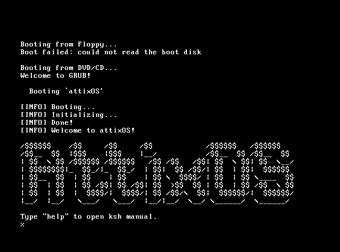

# AttixOS


A minimalist, lightweight operating system based on [attixOS](https://github.com/callmesalmon/attixOS).

[](https://www.gnu.org/licenses/old-licenses/gpl-2.0.en.html#SEC1)

## Overview
AttixOS is a lightweight, minimalist operating system designed. Built as a derivative of [pearlOS](github.com/callmesalmon/pearlOS).


## Getting Started
 **checkout the [LICENSE](requirements.txt)**

## Building from Source
```bash
git clone https://github.com/androvonx95/AttixOS.git
cd AttixOS
./configure && make run
```
**to uninstall**
```bash
make clean
```

**obviously fresh builds can be done with**
```bash
make clean && ./configure && make run
```
## Contributing
Contributions are most welcome!!!.

## License
This project is licensed under the GPLv2 License - see the [LICENSE](LICENSE) file for details.

## Acknowledgments
- [attixOS](https://github.com/callmesalmon/attixOS) for the foundation..( which I happen to be a maintainer of ... please check it out its a cool project!!)
